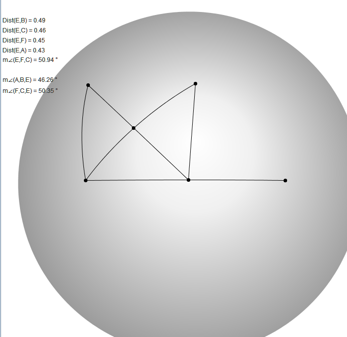

Constructing  EAT construction in spherical geometry, trying to find when it fails and when it succeeds.

One example of when it fails is when the dot is at a pole, and the segments extend down to the middle of the sphere. Then all the angles would be 90 degrees, and so obviously EAT would fail.

There is another form of EAT, called the High School Exterior Angle Theorem (HSEAT) that can be considered the "stronger" alternative to EAT, the HSEAT states the size of an exterior angle at a vertex of a triangle *equals* the sum of the sizes of the interior angles at the other two vertices of the triangle.