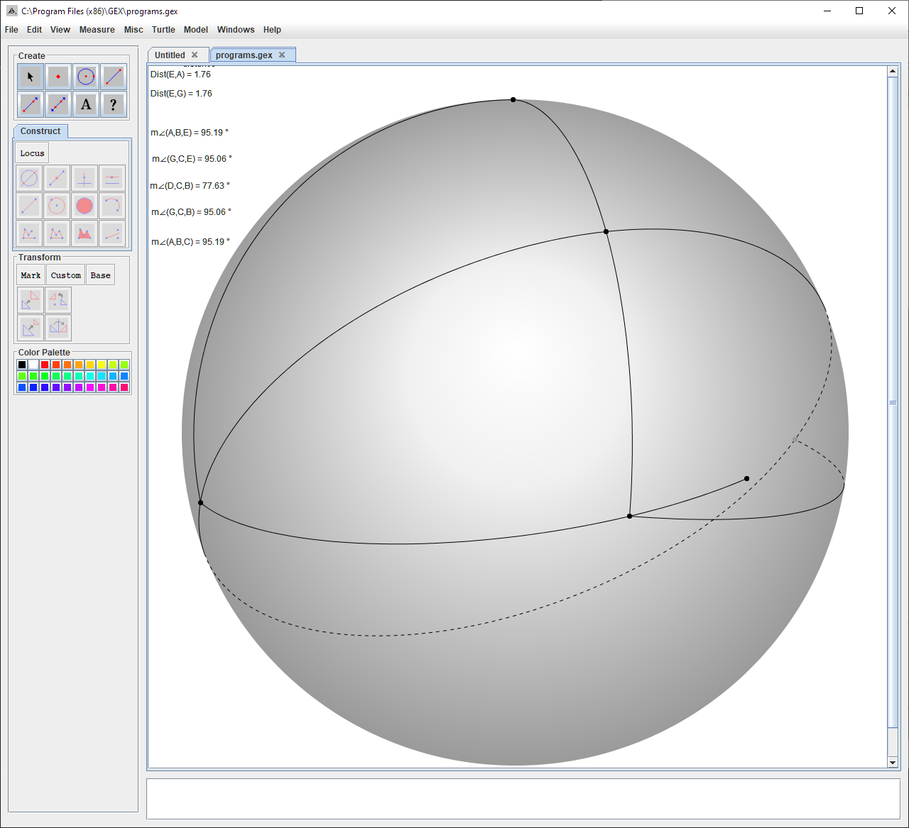

Shown above is a GEX construction for a triangle satisfying EAT in Spherical Geometry. As you can see, angle $BCD$ is greater than any of the other measured angles.

EAT is unsatisfied when point $B$ nears a pole, and the points $A$ and $C$ go beyond the equator. Since this is a sphere, so long as points $A$ and $C$ go to, or beyond the equator relative to the point $B$, EAT will not be true. As seen in the above screenshot, the angle $BCD$ is less than all of the other measured angles.
