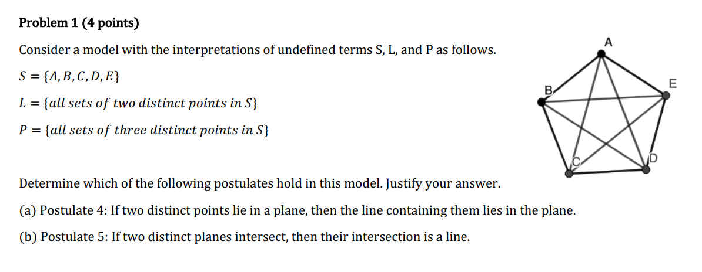
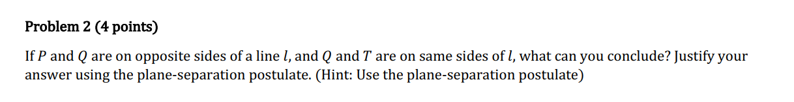
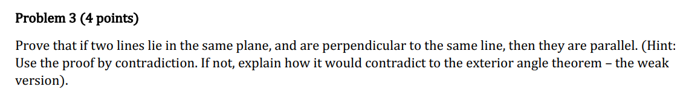
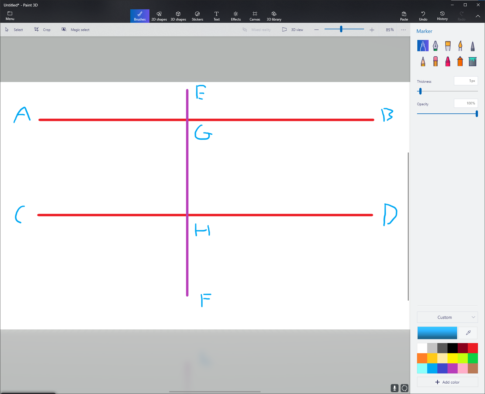
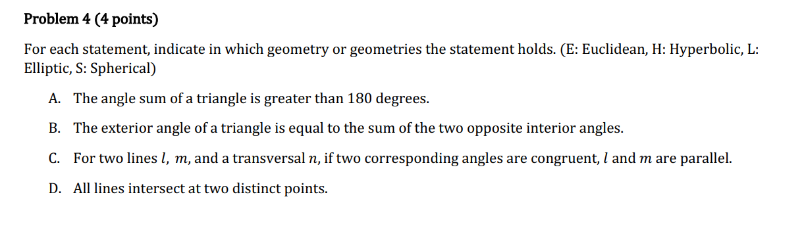
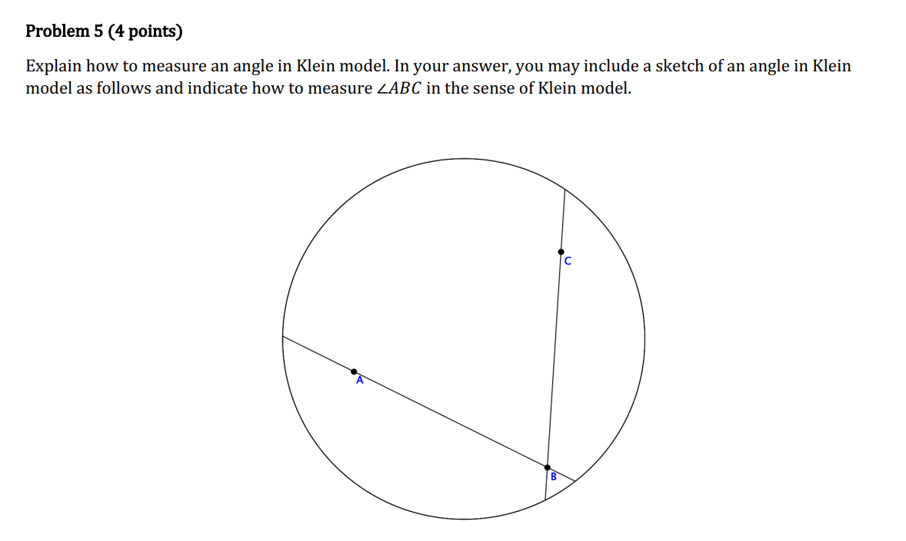
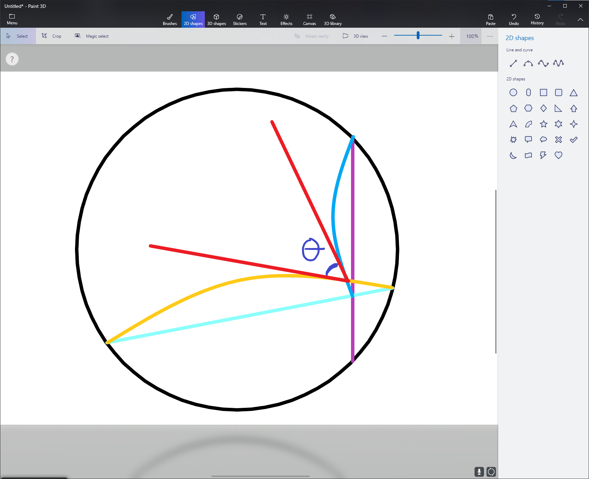

All distinct lines:

$(A,B),(A,C),(A,D),(A,E),(B,C),\\(B,D),(B,E),(C,D),(C,E),(D,E)$

All distinct planes:

$(A,B,C),(A,B,D),(A,B,E),(A,C,D),\\(A,C,E),(A,D,E),(B,C,E),(B,D,E),\\(B,C,D),(C,D,E)$

(a)

Clearly, for all of these planes, if we choose any two points that both lie in a plane, there must be a line containing them that also lies in that plane.

(b)

Counter example:

$(A,B,C)\cap(A,D,E)=A$ this is only one point and so their intersection is not a line.

We can conclude that $P$ and $T$ are on opposite sides of $l$ as well.

The plane separation postulate means that $P$ and $Q$ are in different sets, however, $Q$ and $T$ are on the same side and can be said to be contained in the same set. Thus, a segment $\overline{PT}$ intersects the line $l$.

From the model above, we know that $\angle EGB$ and $\angle GHD$ are both right angles by the definition of perpendicular lines. And because all right angles are congruent, and angles $G$ and $H$ are corresponding angles, then by Exercise 8.4 from our homework (theorem 35), the two lines $\overleftrightarrow{AB}$ and $\overleftrightarrow{CD}$ must also be parallel.

A. L, S
B. E, H
C. E, H
D. S

To measure the angle theta, we form two semicircles that span the cyan and purple lines, then, create two tangent lines at their intersections (the two red lines), and angle between those tangent lines is our Klein model angle.