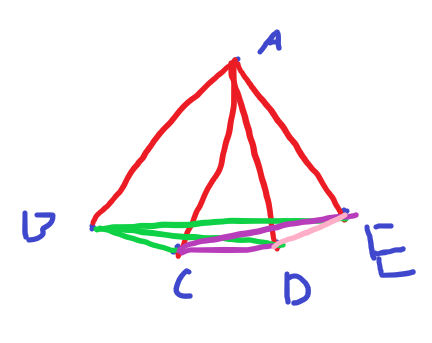

# Weekly Assignment 1

## Exercise 1

### Problem 1

Set $S=\{A,B,C,D\}$

Then, a figure that illustrates this must have every possible line and plane represented.

So $A$ must connect to each of $B,C,D$ at least once. Drawing this:

$B$ must connect to each of $A,C,D$ at least once. Drawing this:

And finally, $C$ must connect to each of $A,B,D$ at least once. Drawing this:

We also see that all possible planes have been made, as every combination of $3$ points is shown in the diagram.

### Problem 2

Postulate 1 is a definition, and clearly holds

Postulate 2 is self apparent, as any two points out of $S=\{A,B,C,D\}$ only have one line connecting them.

Postulate 3 is self apparent, as any three points out of $S=\{A,B,C,D\}$ only have a singular plane enclosed by them.

Postulate 4 is self apparent, one could easily write out all possible planes and lines, and verify that every line is contained within 2 planes.

Postulate 5 is self apparent, the possible planes are:

$\{A,B,C\},\{A,C,D\},\{A,B,D\},\{B,C,D\}$, in fact, all of these planes intersect with another at exactly one line.

Postulate 6

By definition a line contains only two points. By definition a plane contains only three distinct points (And as listed above, in postulate 5).

There is no line that contains all points, and there is no plan that contains all points, and so we have 4 distinct noncollinear and noncoplanar points.

### Problem 3

(a)

The possible intersections of two distinct lines are each of the four points.

If you have two distinct lines that do intersect, then they must intersect at only one of their endpoints.

(b)

The possible intersections of a plane and a line not contained in the plane is a singular point, any of $A,B,C,D$.

If you have a plane and a line not contained in the plane that do intersect, then they must intersect at only one of their endpoints.

(c)

For a line and a point not on that line, there is only one plane that contians both the line and the point.

By definition, a plane has only three distinct points. A line has two distinct points, and another point that is not either of the line's two points makes three distinct points total, which is the definition of a plane.

(d)

The union of two distinct, intersecting lines is a plan. Two distinct, intersecting lines have 3 distinct points in their union.

### Problem 4

(a)

Given a set of 4 points, $\{A,B,C,D\}$, and given two distinct lines, the possible intersections are only at a singular point.

Proof by contradiction:

First, we assume that it is possible to have an intersection with more than one point. This would mean an intersection at both endpoints of the line, as a line contains only $2$ points.

However, this would have error with our previous statement of the lines being distinct.

QED

(b)

Given a set of 4 points, $\{A,B,C,D\}$, and given a line and a plane not containing the line, the possible intersections are only at a singular point.

Proof by contradiction:

First, we assume that it is possible to have an itnersection with more than one point. This point would mean an intersection at both endpoints of the line, as a line contains only $2$ points.

However, this would have contradiction with our previous statement that the plane did not contain the line, as if the intersection of a plane which contains three points and a line which contains two points, is two points, that must mean the line is contained in the plane.

QED

(c)

Given a set of 4 points, $\{A,B,C,D\}$, and given a line and a point not on that line, there is only one plane that contains both the line and the point.

The total number of distinct points for a line, and a point not on that line is three. This is a plane by definition. As all planes, lines, and points are distinct, there is only one plane that contains both the line and the point.

QED

(d)

Given a set of 4 points, $\{A,B,C,D\}$, and given two distinct lines that intersect, the union of the two is a plane.

Every line has two points, distinct lines are lines where both points are not the same. For two lines to intersect, they must meet at at least one point.

So the intersection of two distinct lines occurs at a single point. Meaning the union of these two lines contains the two dissimilar points, as well as the intersecting point. E.g. $\{A,B\}\cup\{B,C\}$ is $\{A,B,C\}$.

By definition, this is a plane.

### Problem 5

Set $S=\{A,B,C,D,E\}$

Then, a figure that illustrates this must have every possible line and plane represented.

So all points must connect with one another at least once. Drawing this:

### Problem 6

Postulate 1 obviously holds

Postulate 2 holds, given any two points, only one line connects the two

Postulate 3 holds, planes are distinct, and as every point connects to every other point only once, there will be exactly one plane for any set of three distinct points

Postulate 4 obviously holds, as any two points contained in a plane will be connected by a line

Postulate 5 does not hold, I could have an intersection of two planes of only a single point, for example: $\{A,B,C\}\cap\{A,D,E\}$ is $A$, which is not a line.

Postulate 6 holds by definition

### Problem 7

The interpretation for problems 1 - 4 still holds, as in this modified system, we are simply removing a restriction (that a space must contain 4 noncollinear points). Our model has 4 distinct noncollinear, and coplanar points.

### Problem 8

## Exercise 2

### Problem 1

Theorem 5:

For every pair of points $A,B$ in $S$,
1. $d(A,B)\ge0$
2. $d(A,B)=0$ if and only if $A=B$
3. $d(A,B)=d(B,A)$

Proof of 1.

In definition 5, we define $AB$ and subsequently, $d(A,B)$ as $|f(A)-f(B)|$ by definition, this equation can never be less than $0$, due to the absolute value.

QED

Proof of 2.

$AB=|f(A)-f(B)|$, let's first set $AB=0$

$0=|f(A)-f(B)|$

Getting rid of the absolute value: $f(A)-f(B)=\pm0$

$f(A)=f(B)$

Thus, $AB$ is $0$ only when $f(A)=f(B)$ as desired.

QED

Proof of 3.

$|f(A)-f(B)|=|f(B)-f(A)|$

$|f(A)-f(B)|=|-(f(A)-f(B))|$

The absolute value gets rid of the negative sign

$|f(A)-f(B)|=|f(A)-f(B)|$

Obviously this is true

### Problem 2

## Exercise 3

### Problem 3

