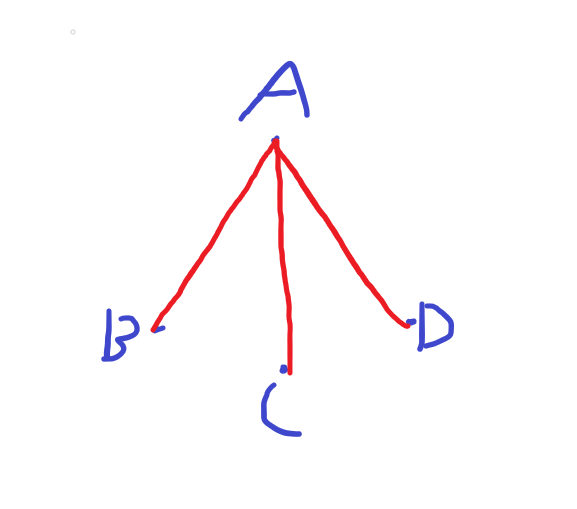
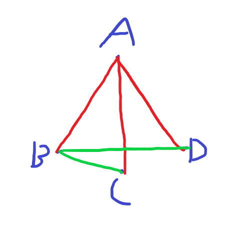
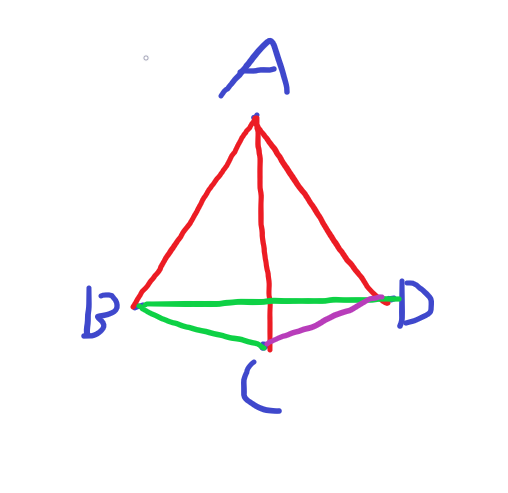

# Weekly Assignment 1

## Exercise 1

### Problem 1

Set $S=\{A,B,C,D\}$

Then, a figure that illustrates this must have every possible line and plane represented.

So $A$ must connect to each of $B,C,D$ at least once. Drawing this:

$B$ must connect to each of $A,C,D$ at least once. Drawing this:

And finally, $C$ must connect to each of $A,B,D$ at least once. Drawing this:

We also see that all possible planes have been made, as every combination of $3$ points is shown in the diagram.

### Problem 2

Postulate 1 is a definition, and clearly holds

Postulate 2 is self apparent, as any two points out of $S=\{A,B,C,D\}$ only have one line connecting them.

Postulate 3 is self apparent, as any three points out of $S=\{A,B,C,D\}$ only have a singular plane enclosed by them.

Postulate 4 is self apparent, one could easily write out all possible planes and lines, and verify that every line is contained within 2 planes.

Postulate 5 is self apparent, the possible planes are:

$\{A,B,C\},\{A,C,D\},\{A,B,D\},\{B,C,D\}$, in fact, all of these planes intersect with another at exactly one line.

Postulate 6

By definition a line contains only two points. By definition a plane contains only three distinct points (And as listed above, in postulate 5).

There is no line that contains all points, and there is no plan that contains all points, and so we have 4 distinct noncollinear and noncoplanar points.

### Problem 3

(a)

The possible intersections of two distinct lines are each of the four points.

If you have two distinct lines that do intersect, then they must intersect at only one of their endpoints.

(b)

The possible intersections of a plane and a line not contained in the plane is a singular point, any of $A,B,C,D$.

If you have a plane and a line not contained in the plane that do intersect, then they must intersect at only one of their endpoints.

(c)

For a line and a point not on that line, there is only one plane that contians both the line and the point.

By definition, a plane has only three distinct points. A line has two distinct points, and another point that is not either of the line's two points makes three distinct points total, which is the definition of a plane.

(d)

The union of two distinct, intersecting lines is a plan. Two distinct, intersecting lines have 3 distinct points in their union.

### Problem 4

