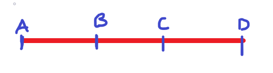
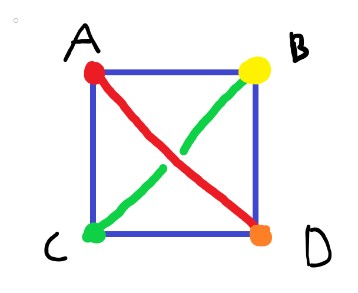

# Weekly Assignment 1

## Exercise 1

### Problem 1

Set $S=\{A,B,C,D\}$

Then, a figure that illustrates this must have every possible line and plane represented.

So each point must connect with all others at least once. Drawing this:

We also see that all possible planes have been made, as every combination of $3$ points is shown in the diagram.

### Problem 2

Postulate 1 is a definition, and clearly holds

Postulate 2 is self apparent, as any two points out of $S=\{A,B,C,D\}$ only have one line connecting them.

Postulate 3 is self apparent, as any three points out of $S=\{A,B,C,D\}$ only have a singular plane enclosed by them.

Postulate 4 is self apparent, one could easily write out all possible planes and lines, and verify that every line is contained within 2 planes.

Postulate 5 is self apparent, the possible planes are:

$\{A,B,C\},\{A,C,D\},\{A,B,D\},\{B,C,D\}$, in fact, all of these planes intersect with another at exactly one line.

Postulate 6

By definition a line contains only two points. By definition a plane contains only three distinct points (And as listed above, in postulate 5).

There is no line that contains all points, and there is no plan that contains all points, and so we have 4 distinct noncollinear and noncoplanar points.

### Problem 3

(a)

The possible intersections of two distinct lines are each of the four points.

If you have two distinct lines that do intersect, then they must intersect at only one of their endpoints.

(b)

The possible intersections of a plane and a line not contained in the plane is a singular point, any of $A,B,C,D$.

If you have a plane and a line not contained in the plane that do intersect, then they must intersect at only one of their endpoints.

(c)

For a line and a point not on that line, there is only one plane that contians both the line and the point.

By definition, a plane has only three distinct points. A line has two distinct points, and another point that is not either of the line's two points makes three distinct points total, which is the definition of a plane.

(d)

The union of two distinct, intersecting lines is a plan. Two distinct, intersecting lines have 3 distinct points in their union.

### Problem 4

(a)

Given a set of 4 points, $\{A,B,C,D\}$, and given two distinct lines, the possible intersections are only at a singular point.

Proof by contradiction:

First, we assume that it is possible to have an intersection with more than one point. This would mean an intersection at both endpoints of the line, as a line contains only $2$ points.

However, this would have error with our previous statement of the lines being distinct.

QED

(b)

Given a set of 4 points, $\{A,B,C,D\}$, and given a line and a plane not containing the line, the possible intersections are only at a singular point.

Proof by contradiction:

First, we assume that it is possible to have an itnersection with more than one point. This point would mean an intersection at both endpoints of the line, as a line contains only $2$ points.

However, this would have contradiction with our previous statement that the plane did not contain the line, as if the intersection of a plane which contains three points and a line which contains two points, is two points, that must mean the line is contained in the plane.

QED

(c)

Given a set of 4 points, $\{A,B,C,D\}$, and given a line and a point not on that line, there is only one plane that contains both the line and the point.

The total number of distinct points for a line, and a point not on that line is three. This is a plane by definition. As all planes, lines, and points are distinct, there is only one plane that contains both the line and the point.

QED

(d)

Given a set of 4 points, $\{A,B,C,D\}$, and given two distinct lines that intersect, the union of the two is a plane.

Every line has two points, distinct lines are lines where both points are not the same. For two lines to intersect, they must meet at at least one point.

So the intersection of two distinct lines occurs at a single point. Meaning the union of these two lines contains the two dissimilar points, as well as the intersecting point. E.g. $\{A,B\}\cup\{B,C\}$ is $\{A,B,C\}$.

By definition, this is a plane.

### Problem 5

Set $S=\{A,B,C,D,E\}$

Then, a figure that illustrates this must have every possible line and plane represented.

So all points must connect with one another at least once. Drawing this:

### Problem 6

Postulate 1 obviously holds

Postulate 2 holds, given any two points, only one line connects the two

Postulate 3 holds, planes are distinct, and as every point connects to every other point only once, there will be exactly one plane for any set of three distinct points

Postulate 4 obviously holds, as any two points contained in a plane will be connected by a line

Postulate 5 does not hold, I could have an intersection of two planes of only a single point, for example: $\{A,B,C\}\cap\{A,D,E\}$ is $A$, which is not a line.

Postulate 6 holds by definition

### Problem 7

The interpretation for problems 1 - 4 still holds, as in this modified system, we are simply removing a restriction (that a space must contain 4 noncollinear points). Our model has 4 distinct noncollinear, and coplanar points.

### Problem 8

Yes, this interpretation is possible. None of the points $\{A,B,C,D\}$ are coplanar (there are no planes in this model).

## Exercise 2

### Problem 1

Theorem 5:

For every pair of points $A,B$ in $S$,
1. $d(A,B)\ge0$
2. $d(A,B)=0$ if and only if $A=B$
3. $d(A,B)=d(B,A)$

Proof of 1.

In definition 5, we define $AB$ and subsequently, $d(A,B)$ as $|f(A)-f(B)|$ by definition, this equation can never be less than $0$, due to the absolute value.

QED

Proof of 2.

$AB=|f(A)-f(B)|$, let's first set $AB=0$

$0=|f(A)-f(B)|$

Getting rid of the absolute value: $f(A)-f(B)=\pm0$

$f(A)=f(B)$

Thus, $AB$ is $0$ only when $f(A)=f(B)$. Due to $f$ being a one to one function, $A$ must equal $B$. $AB$ is $0$ only when $A=B$ as desired.

QED

Proof of 3.

$|f(A)-f(B)|=|f(B)-f(A)|$

$|f(A)-f(B)|=|-(f(A)-f(B))|$

The absolute value gets rid of the negative sign

$|f(A)-f(B)|=|f(A)-f(B)|$

Obviously this is true

### Problem 2

First we must show that $g$ is one to one:

We already know that $f(A)$ is one to one, and $g(A)=-f(A)$, so by definition, $g(A)$ is one to one as well.

$x=g(A)=-f(A),y=g(B)=-f(B)$

Then, $|x-y|=|-f(A)+f(B)|$

This is equivalent to: $|f(B)-f(A)|$

Which, according to 3. of theorem 5, is equivalent to $|f(A)-f(B)|$, thus $g$ is a coordinate system for $l$.

QED

### Problem 3

First, we define that $x=g(A)=f(A)+a$, $y=g(B)=f(B)+a$

Then, $AB=|x-y|=|f(A)+a-(f(B)+a)|=|f(A)-f(B)|$

QED

### Problem 4

Firstly, via postulate 8, we know that every line has coordinate systems of $|f(x)-f(y)|=xy$ where $x$ and $y$ are the any two points of the line.

For the sake of argument here, let's set $x,y$ to be the two end points of the line.

Then, from theorem 7, I can say that the line can also be described via: $|f(x)+a-(f(y)+a)|$, here we'll define $g(A)=f(x)+a$ and $g(B)=f(y)+a$

Then, we can set $a$ such that $g(A)=f(x)+a$ is $0$, then, $|-g(B)|$ is our new valid coordinate system.

Then, because of theorem 6, we can say that $|-g(B)|=|g(B)|$

We have shown that for any line $l$, we can create a coordinate system where for any two points $x,y$ on that line, there is always a way to change $x=0$ and $y>0$.

### Problem 5

Using the model from the original problem:

We have now that $AA=0$ for all point $A$ in $S$ and $AB=1$ for all distinct points $A,B$ in $S$.

### Problem 6

## Exercise 3

### Exercise 3.1

We are trying to prove that if $A-B-C$ (B is between A and C), then $C-B-A$ (B is between C and A).

The equation for $A-B-C$ is $AB+BC=AC$, then, for $C-B-A$, the equation becomes:

$CB-BA=CA$, based off of theorem 6, we can say that the $|CB| = |BC|$

### Exercise 3.2

Theorem 10 states:

Let $l$ be a line with a coordinate system $f$ and let $A,B,$ and $C$ be three points on $l$ with coordinates $r,s,t$ respectively. If $r-s-t$, then $A-B-C$

Postulate 8 states:

Every line has a coordinate system.

We know that a coordinate system is one to one and maps a value in the real numbers to a point on our line.

This means that $r,s,t$ are all unique, and all map to a single value.

We also know from definition 6 and 7 that $A,B,C$ are also all distinct points, meaning they don't lie on top of each other.

Then, because $r=A$, $s=B$ and $t=C$, if $r-s-t$ then $A-B-C$ must be true.

Theorem 11 states:

For any three points on a line, exactly one of the points is between the other two.

Theorem 12 states:

If $A$ and $B$ are any two points, then

(1) there is a point $C$ such that $A-B-C$
(2) there is a point $D$ such that $A-D-B$

Let's define $4$ coordinates $r,s,t,u$ where $r=A,s=B,t=C,u=D$

We already know that each of these values are unique, and one to one.

If we have $A-B-C$, this must mean that $A<B<C$.

Let's choose a $C$ s.t. $C=2|B|$, then we can see that obviously $A<B<2|B|$

If we have $A-D-B$, this must mean that $A<D<B$.

Let's choose a $D$ s.t. $D=\frac{A+B}{2}$, this guarantees that $D$ is greater than $A$ and less than $B$, thus $A<D<B$

### Exercise 3.3

The converse of theorem 10:

Let $l$ be a line with a coordinate system $f$ and let $A,B,$ and $C$ be three points on $l$ with coordinates $r,s,t$ respectively. If $A-B-C$, then $r-s-t$

As for the reasons above in previous proof for theorem 10, we can say that because $r=A$, $s=B$ and $t=C$, if $A-B-C$ then $r-s-t$ must be true

### Exercise 3.4

If $A-B-C$, that must mean that $A<B<C$

If $B-C-D$, that must mean that $B<C<D$

Thus, by transitivity of the $<$ operator, $A<B<D$ and $A<C<D$

This implies that $B$ is between $A$ and $D$ and $C$ is between $A$ and $D$

### Exercise 3.5

## Exercise 4

### Exercise 4.1

