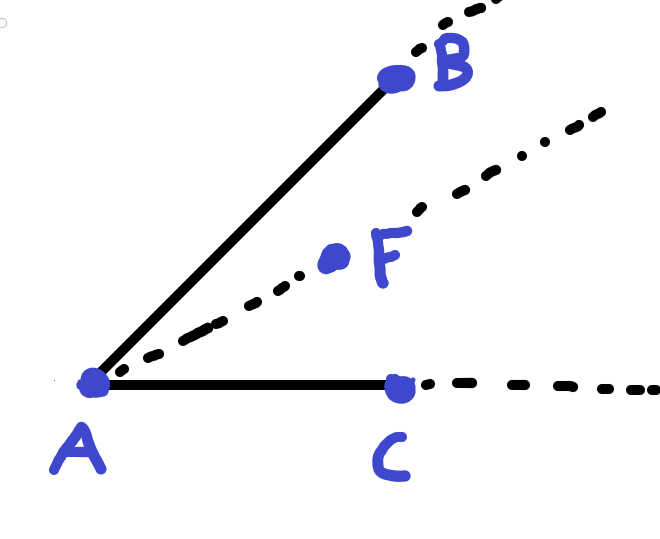
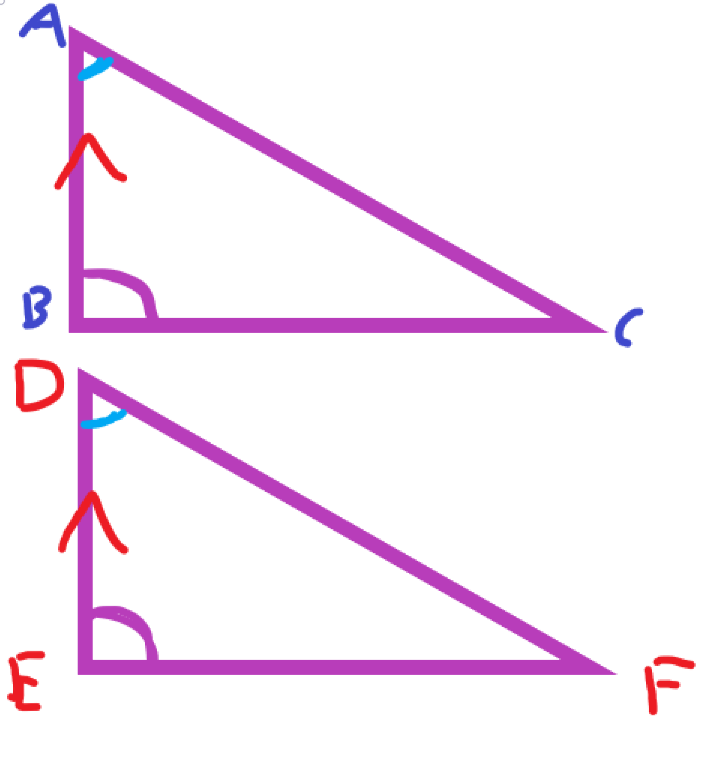

## Exercise 5

### Exercise 5.5

You can say that T is on the opposite side of point $P$.

A line only has two sides, so if a point $Q$ and a point $T$ are on the same side, any point that is on the opposite side of either $Q$ or $T$, is on the opposite side of the other.

### Exercise 5.9

Say a line $l$ divides a plane into two halves. Clearly, if w have a triangle $\triangle ABC$, then two out of these three points will lie on one half.

Then, these two points (say, $A$ and $B$)

Then $l$ does not intersect the line $AB$ of the triangle.

### Exercise 5.14

Proof by contradiction:

We can first assume that $P$ and $A$ are on opposite sides of the line of $\overleftrightarrow{BC}$, and that $\overline{PA}$ must intersect $\overleftrightarrow{BC}$

Then: $P,C\in\overleftrightarrow{AC}$ and $P,C\in\overleftrightarrow{BC}$

Thus we have a contradiction because we say that the lines must intersect at at most, one point.

### Exercise 5.15

We know that $F$ and $B$ are on the same side of line $\overleftrightarrow{AC}$

We also know that $F$ and $C$ are on the same side of $\overleftrightarrow{BC}$

Then, any point on $\overrightarrow{AF}-\{A\}$ must be on the same side of $B$ as every other point on $\overrightarrow{AF}-\{A\}$

Now, let's choose points $P\in\overrightarrow{AF}-\{A\}$ and $B$.

By contradiction:

We assume that $P$ and $B$ are on opposite sides of the $\overleftrightarrow{AC}$, then we have a contradiction because we know that $F$ is on the same side of $\overleftrightarrow{AC}$ as $B$, and if $P$ and $B$ were on opposite sides, $P$ would no longer lie in the same half plane as $F$, $P$ would no longer be on $\overrightarrow{AF}-\{A\}$

### Exercise 5.16

First, we must show that $G$ and $D$ are on the same side of $\overleftrightarrow{BC}$

We have that $G$ and $A$ are on opposite sides of $\overleftrightarrow{BC}$ and that $A$ and $D$ are on opposite sides of $\overleftrightarrow{BC}$

Clearly $G$ and $D$ are on the same side of $\overleftrightarrow{BC}$ (by exercise 5.4, 5.4)

Next, we must show that $G$ and $B$ are on the same side of $\overleftrightarrow{CD}$

We know that $F$ is in the interior of $\angle BAD$, then $G$ must be in the interior of $\angle BAD$ (by exercise 5.15)

Then $G$ and $B$ are on the same side of $\overleftrightarrow{AD}$

## Exercise 6

### Exercise 6.4

By exercise 5.7 (not shown), we know that $\overrightarrow{AG}$ and $\overrightarrow{FB}$ are on opposite sides of $l$.

Assuming that there exists a point $P\in\overrightarrow{G}\cap\overrightarrow{FB}$

Then, there is a contradiction because $P$ now belongs to both half planes $l$.

### Exercise 6.5

By exercise 5.15, $\overrightarrow{AD}-\{A\}$ must belong to either $\angle FAB$ or $\angle CAB$. Then, by exercise 5.14, $\overline{FB}$ belongs to $\angle FAB$ and $\overline{BC}$ belongs to $\angle CAB$

Then, $\overrightarrow{AD}$ must intersect exactly one of $\overline{FB}$ or $\overline{BC}$

### Exercise 6.6

Proof:

First, take $F-A-C$, we know that $F$ and $C$ are on opposite sides of $\overleftrightarrow{AB}$. Then we also know that $D$ is on the side of $\overleftrightarrow{AB}$ that $C$ is.

Thus, $F$ and $D$ are on opposite sides of $\overleftrightarrow{AB}$

Then, the ray $\overrightarrow{AD}$ does not intersect $\overline{FB}$ for $A\ne B$

Then, taking a new point $G$ where $D-A-G$ so $\overrightarrow{AG}$ and $\overrightarrow{AD}$ are opposite open rays.

We know that $\overleftrightarrow{AC}$ separates the plane of $\triangle FBC$ into two open, opposite half planes. 

The open ray $\overrightarrow{AG}$ doesn't intersect $\overline{FB}$ for $A\ne F$

And the line segment $\overline{FB}$ doesn't contain $A$ and $\overrightarrow{AG}$ doesn't contain $F$

Then, we know that $\overrightarrow{AD}$ doesn't intersect $\overline{FB}$, and that $B$ is on the $F$ side of $\overleftrightarrow{AD}$

Then, $B$ and $C$ are on opposite sides of $\overleftrightarrow{AD}$

Then $\overleftrightarrow{AD}$ intersects $\overline{BC}$

$\overrightarrow{AG}$ and $\overline{BC}$ (but not point $C$) both lie on opposite sides of $\overleftrightarrow{AC}$, so they have no points in common.

Then, $\overrightarrow{AD}$ intersects $\overline{BC}$

QED.

### Exercise 6.9

Take any convex quadrilateral $\square ABCD$

We can form a triangle $\triangle ABC$ s.t. any ray extending from $A$ towards $B$ and $C$ must cross $\overline{BC}$ (crossbar theorem) 

Then, $\overline{AD}$ must cross $\overline{BC}$, where $\overline{AD}$ and $\overline{BC}$ are both diagonals of our convex quadrilateral.

### Exercise 6.12

Via the angle construction postulate, there is at least one line that is perpendicular to $l$.

Using a proof by contradiction:

We define two angles $\angle APD$ and $\angle DPB$ s.t. they are a linear pair where the measure of $\angle DPB$ is $90^\circ$

Define another pair of angles $\angle APC$ and $\angle CPB$, then they are a linear pair and the measure of $\angle APC=90^\circ$

But then because of postulate 11, the measure of $\angle DPC=0$, which clearly contradicts our construction.

## Exercise 7

### Exercise 7.3

Using the S-A-S postulate, we know that the angle $\angle BAC$ is congruent to $\angle ACB$, we also know that $\angle BAC$ is congruent to $\angle CBA$, then by transitivity of equals, $\angle BAC=\angle ACB=\angle CBA$

### Exercise 7.4

#### Theorem 25

Let's construct two triangles $\triangle ABC$ and $\triangle DEF$ that satisfies ASA

Now place a point $P$ on $\overline{AC}$ s.t. $\overline{AP}=\overline{DF}$, $\angle BAP=\angle BAC$ and $=\angle EDF$. Then, $\triangle DEF=\triangle ABP$

There are two possibilities for point $P$, either $P$ is the same as point $C$ or it is not.

If $P$ is not $C$ then $P$ is not on ray $\overrightarrow{BC}$ because line segment $\overline{AC}$ and ray $\overrightarrow{BC}$ only intersect at $C$, then the angle of $\angle ABP\ne\angle ABC$. But this is a contradiction because $\angle ABP=\angle DEF$ because triangles $\triangle DEF=\triangle ABC$ and angle $\angle DEF=\angle ABC$

Then $P$ must be the same as $C$, then the triangle $\triangle ABC=\triangle DEF$

#### Theorem 26

Construct a triangle $\triangle ABC$, if $\angle B\cong\angle C$, then the triangle satisfies ASA, and as such, $\overline{AB}$ and $\overline{AC}$

#### Theorem 27

From theorem 26, if two angles are equal, their opposite sides are equal, then clearly a triangle with three equal angles has three equal sides.

A triangle $\triangle ABC$ with $\angle A=\angle B=\angle C$ then must have $\overline{BC}=\overline{AC}=\overline{AB}$

### Exercise 7.7

If we have two triangles $\triangle ABC$ and $\triangle DEF$ whose sides are respectively equal, then these two triangles must be equal.

To prove this, we first place the second triangle so that $\overline{EF}$ coincides with $\overline{BC}$, and have both triangles lie on the same side of $\overline{BC}$

Replacing $\overline{EF}$ with $\overline{BC}$, we now have a new triangle $\triangle DBC$.

If these two triangles are equal, then point $D$ will coincide with point $A$

Proof by contradiction:

Assuming that the above statement is false, then that means that we would have two isosceles triangles $\triangle BAD$ and $\triangle CAD$, the perpendicular bisector of $\overline{AD}$ must pass through $B$ and $C$, but this is impossible because points $A$ and $D$ lie on the same side of $BC$, and therefore cannot cross. Then, points $A$ and $D$ cannot be different.

### Exercise 7.10

Given two triangles, $\triangle ABC$ and $\triangle DEF$, we are given that $\angle B\cong\angle E$, and $\angle C\cong\angle F$, and that $\overline{AB}=\overline{DE}$

We must prove that $\triangle ABC\cong\triangle DEF$

Proof by contradiction:

First, let's assume that $\overline{BC}\ne\overline{EF}$

Then, either $\overline{BC}>\overline{EF}$ or $\overline{EF}>\overline{BC}$

Construct a new point $H$ on $\overline{BC}$ s.t. $\overline{BH}=\overline{EF}$, then we can construct $\overline{AH}$

Then, because $\overline{BH}=\overline{EF},\angle B=\angle E,\overline{AB}=\overline{DE}$

From SAS, we know that $\angle H=\angle F$

But from theorem 29, we know that $\angle H>\angle C=\angle F$

This contradicts our original statement.

Thus, $\overline{BC}=\overline{EF}$

And from SAS, $\triangle ABC=\triangle DEF$

### Exercise 7.14

We know that $\overline{AB}\ncong\overline{AC}$ due to exercise 7.2

Then, we must prove that if $\overline{AB}>\overline{AC}$, then the measure of $\angle B$ is less than the measure of $\angle C$

Proof by contradiction:

Let's assume that $\overline{AC}>\overline{AB}$, that means that we can extend $\overline{AB}$ to some point $D$ s.t. $\overline{AD}\cong\overline{AC}$

Then, this must mean that $\angle ADC\cong\angle ACD$ (because we have an isosceles triangle)

Thus, $\angle ACB<\angle ADC$, however, this contradicts the initial assumption that $\angle B$ is less than the measure of $\angle C$

Thus, $\overline{AB}>\overline{AC}$

### Exercise 7.15

Define a $\triangle ABC$, then we need to prove that (without loss of generality) $\overline{AB}+\overline{AC}>\overline{BC}$

First, let's extend $\overline{BA}$ to a point $D$ s.t. $\overline{AD}=\overline{AC}$ and $\angle ACD=\angle D$

Thus, in $\triangle BC$, $\angle BCD>\angle D$. From exercise 7.14, we then know that $\overline{BD}>\overline{BC}$

Then, $\overline{AB}+\overline{AD}>\overline{BC}$, and because $AD=\overline{AC}$, $\overline{AB}+\overline{AC}>\overline{BC}$ as required.