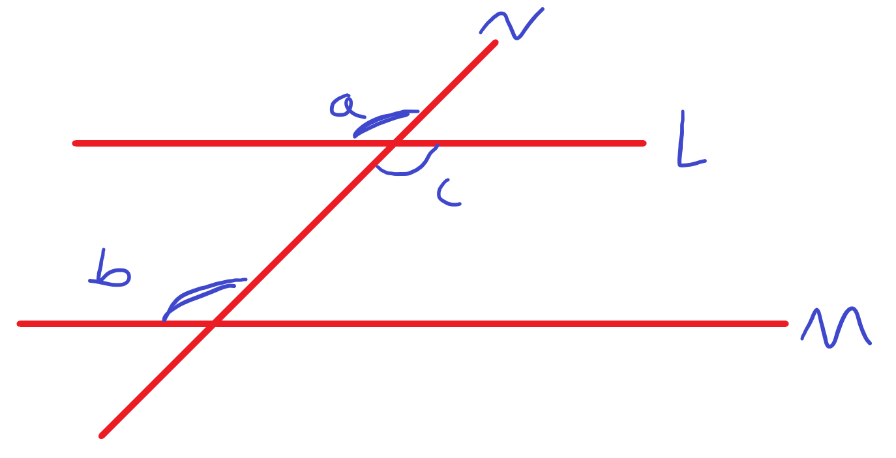
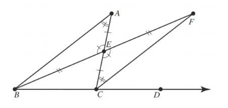
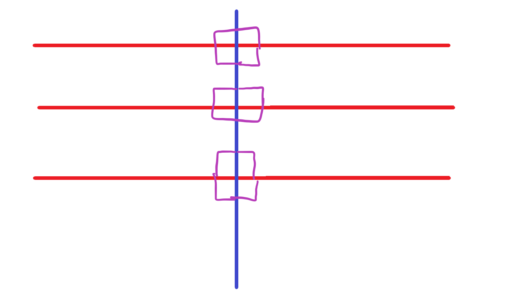

## Exercise 8

### Exercise 8.2

By the SSS theorem, we know that there must be a line through a point $p$ that is perpendicular to a line $l$

We also know by postulate 12 that there must be a line $n$ that goes through $p$ and is perpendicular to a line $m$

Thus, we know that the two lines $n$ and $l$ must be parallel since they both have a common line $m$ that is perpendicular to each.

### Exercise 8.4

If we let $l$ and $m$ be two distinct lines that both have a transversal of $n$ that is on the same plane, then the measure of angle $a$ is less than the measure of angle $b$. Then, $a$ and $c$ are equal angles because they are vertical angles.

By theorem 34, $l$ and $m$ are parallel because $l$ and $m$ have a pari of alternate interior angles that are congruent to each other.

### Exercise 8.8

Draw a diagram:

Let's then assume that we create a triangle $\angle ABC$ s.t. it has an interior angle sum of more than $180^\circ$, this angle measure is $180^\circ + \epsilon^\circ$ for some $\epsilon>0$

With the archimedean postulate, we know that there exists a natural number $N$ s.t. the Nth triangle in this construction has an angle that is less than $\epsilon$. Thus, the sum of the other angles of this triangles must be greater than $180$ degrees. However, this contradicts 8.5 that says that the sum of any two standard euclidean triangles cannot be greater than $180$ degrees.

### Exercise 8.9

The saccheri-legendre theorem states that $m\angle A+m\angle B+m\angle C\le 180$

Thus, $m\angle C+m\angle ACD=180$ by proposition 14.

Using algebra, we can then say that $m\angle A+m\angle B\le m\angle ACD$

### Exercise 8.10

(a) We know this is true from postulate 8
(b)

We know that the $m\angle PQR_1+m\angle QPR_1\le 180$ by the Saccheri-Legendre theorem.

Substituting $90^\circ$ for $m\angle PQR_1$ $90 + m\angle QPR_1+m\angle QR_1P\le180$

Thus, $m\angle QR_1P\le\frac{180-90}{2}=45$

(c) This is also satisfied due to postulate 8

(d)

By the stronger Exterior Angle Theorem, we know that $m\angle QR_2P\le\frac{1}{2}45$ because $m\angle QR_1P\le45$ and $2m\angle QR_2P\le m\angle QR_1P$

(e)

Using Archimedes' theorem:

$m\angle QR_nP\le(\frac{1}{2})^{n-1}\times45<a$, where $a$ is any positive real number.

Then, simplifying this inequality:

$-(n-1)\log 2<\log\frac{a}{45}$

$n-1>\frac{\log\frac{45}{a}}{\log2}$

$n>\frac{\log\frac{45}{a}}{\log2}+1$

## Exercise 9

### Exercise 9.1 (Only Thm 38, 42)

Theorem 38:

.png)

From theorem 37, we know that the alternate interior angles of two parallel lines are congruent.

Then, the measure of angle $A'$ is congruent to angle $B$

Then, because $A$ and $A'$ are congruent because they are vertical pairs, $A$ must be congruent to $B$

Theorem 42:

In the figure, we have three parallel lines with one perpendicular blue line running through all of them.

It is trivial to show that each of the purple angles is congruent to one another, furthermore, each angle is $90$ degrees, as such, we have three parallel lines. Then, we know that if we have two parallel lines, and one of those lines is parallel to another line, they must all be parallel to each other.

### Exercise 9.2

First, let $l$ and $m$ be two distinct lines and let $n$ be a transversal that intersects both $l$ and $m$ at two points, $Q$ and $P$ at right angles.

Using the Hyperbolic Parallel Postulate, we know that there exists a line $n$ that goes through $P$ and that is also parallel to $l$.

Then, without loss of generality, we know that the angle that is between $n$ and $\overline{PQ}$ at the point $P$ is less than $90^\circ$. Let's say the measure of this angle is $90-\epsilon$ for some $\epsilon$ greater than $0$.

Then, there exists a point $R_n$ on $l$ s.t. $m\angle PR_NQ<\epsilon$

Then, this means that the sum of our angles $90+90-\epsilon<180$