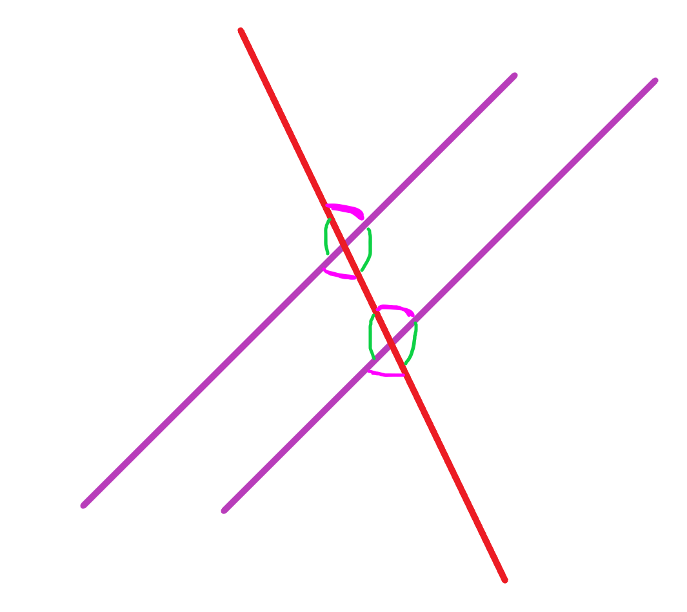

## Exercise 8

### Exercise 8.2

### Exercise 8.4

### Exercise 8.8

Let's draw a $\overrightarrow{BD}$ 

Then, two points $A$ and $F$ not on the line to make two triangles

### Exercise 8.9

### Exercise 8.10

## Exercise 9

### Exercise 9.1 (Only Thm 38, 42)

Theorem 38:

### Exercise 9.2
