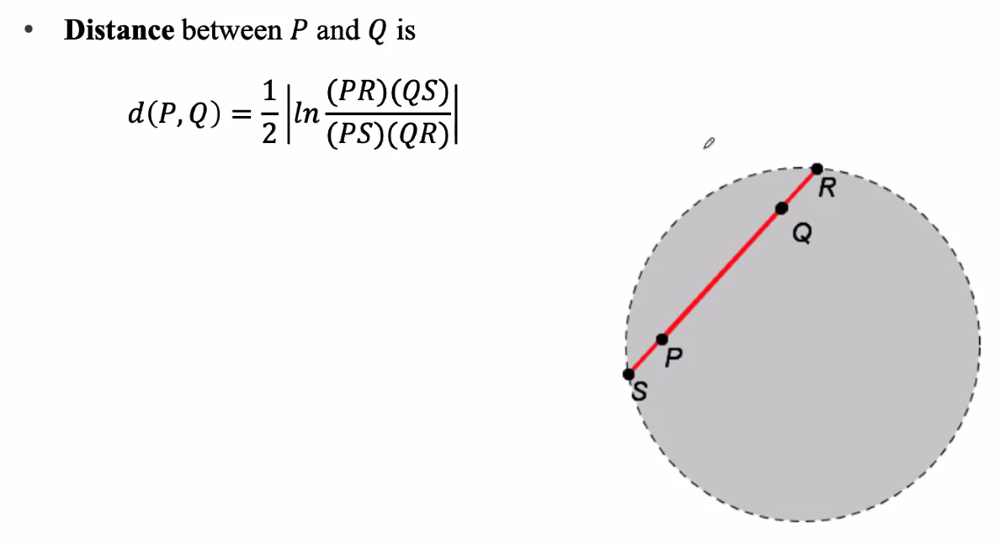
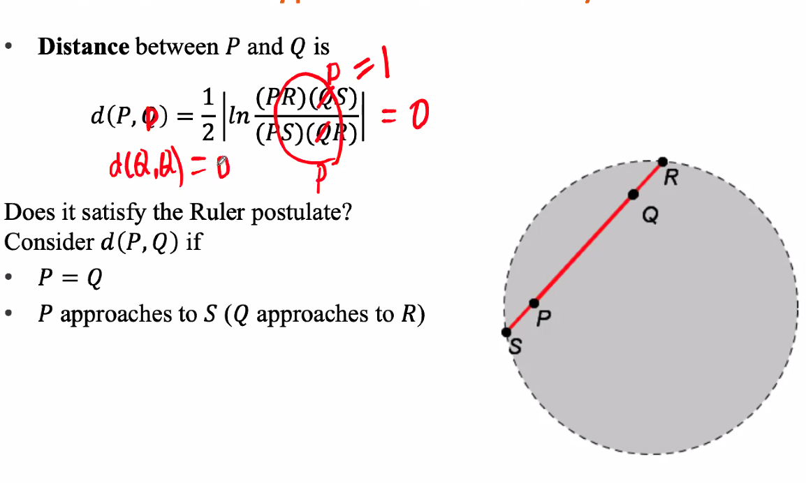
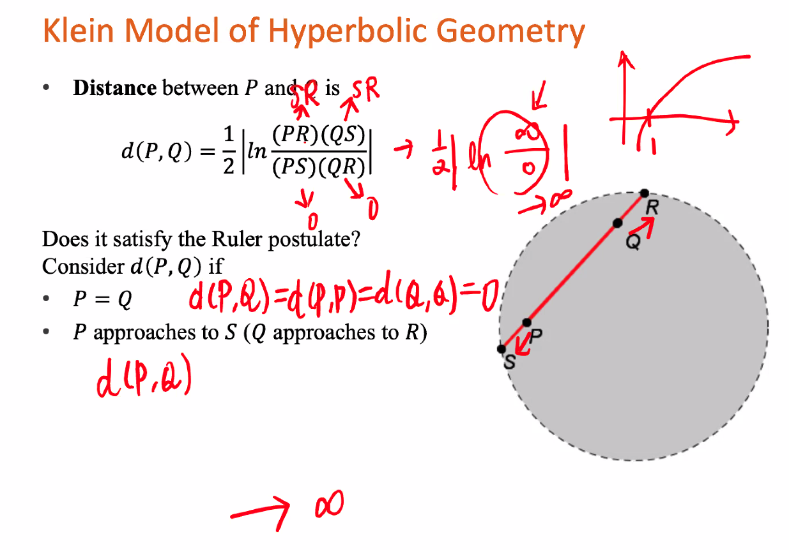

Points on the boundary of the klein model for hyperbolic geometry aren't within the geometric system.

We need to show that this satisfies the ruler postulate

See that if we are measuring itself, ten clearly the distance is $0$, which is satisfied by our formula.

This in fact increases forever with no asymptot, when $p$ approaches $s$

https://www.geogebra.org/classic/at7a2ggd

We can determine angle measure within a Klein model by the geogebra simulation above