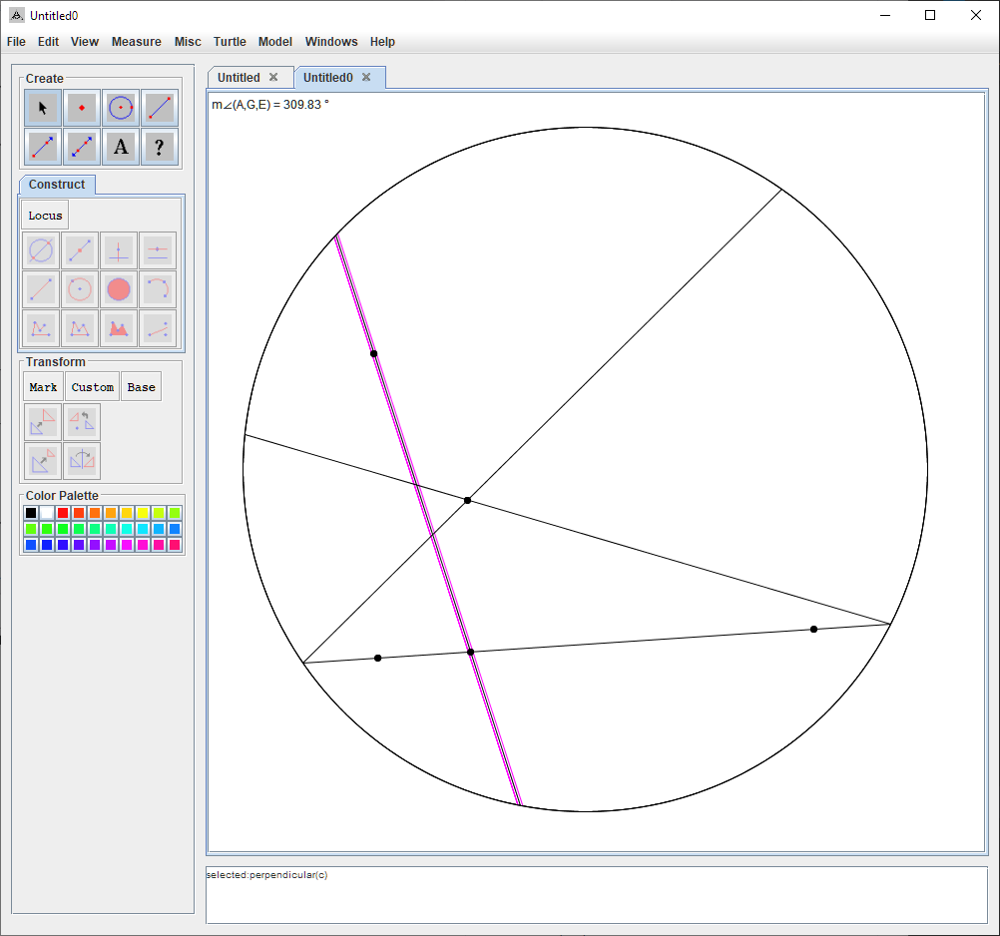

Given any two parallel lines in the klein disc model, you can find a common parallel line in most cases.

If we create limiting parallel lines like the ones selected in the image below:

Then the line selected will never be able to meet both the limiting parallel line, and the line at the bottom at a perpendicular angle.

If angle $\angle QPT$ is right, then $\overline{CB}$ and $\overline{PQ}$ are perpendicular. But this violates the previous discovery in exercise 7.2.3 that says that $\overline{CB}$ and $\overline{AB}$ cannot have a common perpendicular.

Then, $\angle QPT$ cannot be a right angle. If angle $\angle QPB$ is an obtuse one, then clearly there can be a line drawn through $P$ such that we bisect the angle $\angle QPB$ and create a new right angle.

Obviously this line must extend to AB, and intersect AB at some point. The angles in this triangle then would all be right angles, which violates the angle sum of triangles in hyperbolic geometry.

Within elliptic geometry, *every* triangle has a sum of angles that is greater than $180$ degrees, with an upper bound of $540$ degrees.

There are many equilateral triangles in spherical geometry, and a triangle with angles of 90-90-90 would create an equilateral triangle.