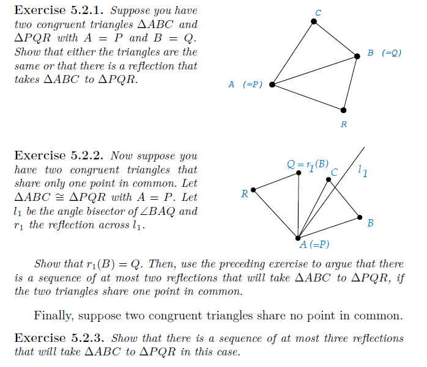

The six isometries that map an equilateral triangle back to itself are:

1. The isometry of the triangle to itself

2. The reflection about $m_1$

3. The reflection about $m_2$

4. The reflection about $m_3$

5. Where the entire triangle is rotated $60$ degrees, such that:

$a\rightarrow b$

$b\rightarrow c$

$c\rightarrow a$

6. Where the entire triangle is rotated $120$ degrees, such that:

$a\rightarrow c$

$b\rightarrow a$

$c\rightarrow b$

In 

